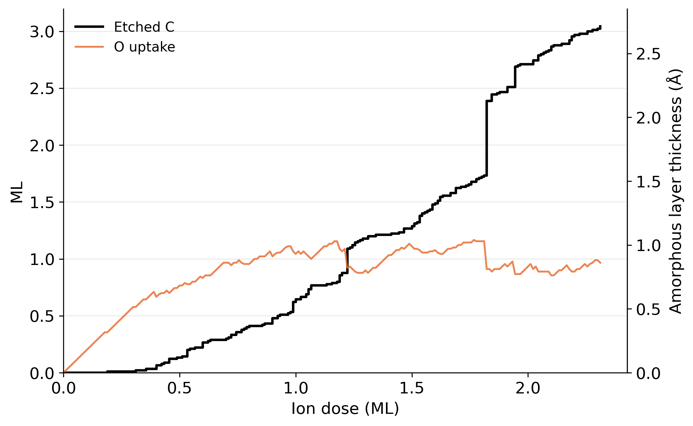
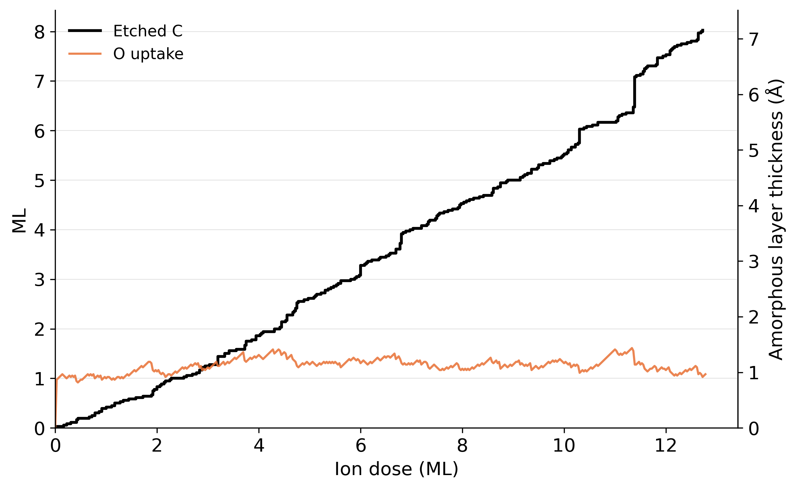
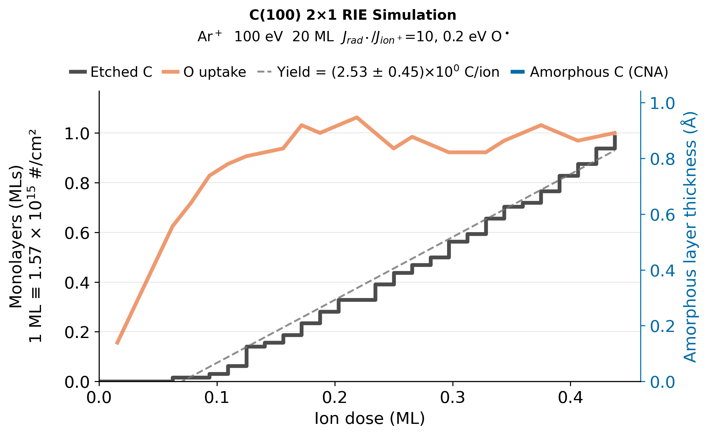
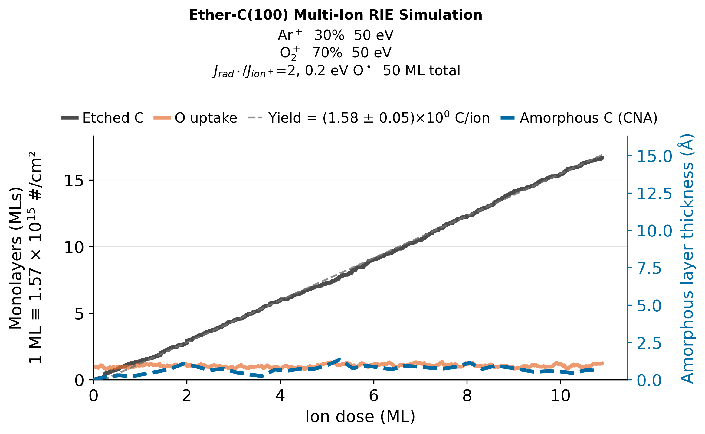
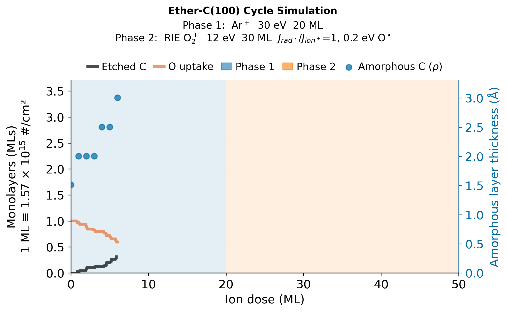
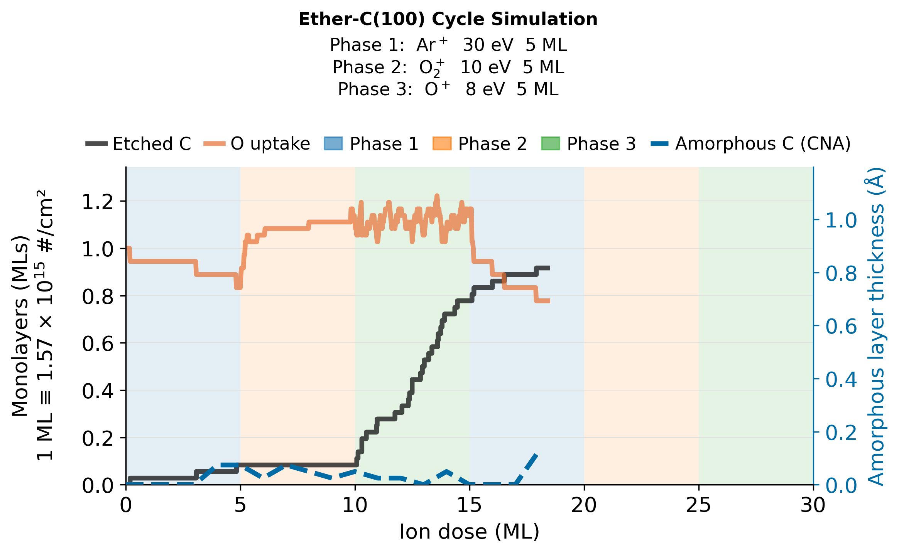

# DiamondEtchMD

Python package for setting up and analysing LAMMPS ReaxFF molecular-dynamics
simulations of diamond surface etching across four crystal orientations and a
range of surface reconstructions. Produces SLURM-ready simulation directories
(requires a GPU).

| Mode | What it models |
|---|---|
| **ion-etch** | Single-species ion bombardment with no radicals. |
| **RIE-etch** | O• radicals deposited between each ion impact for plasma-assisted etching. |
| **multi-ion-etch** | Stochastic multi-component ion mix (e.g. 50% O⁺ + 50% O₂⁺, or energy distribution), no radicals. |
| **multi-RIE-etch** | Multi-component ion mix with O• radical pre-exposure. |
| **cycle-etch / ALE-etch** | Alternating phases of different ionic species, flux ratios, and/or conditions. |

---

## Example simulations

### 1. O₂⁺ ion etch — C(111) Pandey-Chain Reconstruction



```python
# examples/ION_O2_111p.py
from pathlib import Path
from diamond_etch_md import SimSpec, compute_ml, make_sim

nx, ny = 5, 9

spec = SimSpec(
    orientation    = "111",
    surface        = "2x1_pandey",
    surface_temperature = 300.0,
    species        = "O2",
    energy         = 50.0,                          # 50 eV total -> 25 eV per O atom
    ion_angle      = 0.0,
    fluence        = 20,
    ml             = compute_ml("111", nx, ny),
    box_x          = nx,
    box_y          = ny,
    box_depth      = 6,
    impact_time         = 2000.0,
    thermalization_time = 500.0,
    wall_hours     = 24,
    account        = "dgraves",
    name           = "ION_111p_O2_50eV",
)

make_sim(spec, Path("ION_O2_111p"))
```

---

### 2. Multi-ion O⁺ etch — trimodal energy distribution



```python
# examples/MULTI-ION_O_Edist.py
from pathlib import Path
from diamond_etch_md import SimSpec, IonComponent, compute_ml, make_sim, validate, etch_mode

nx, ny = 6, 6
ml = compute_ml("100", nx, ny)   # 36 atoms/ML for 6×6 box

spec = SimSpec(
    orientation    = "100",
    surface        = "O_ether",
    surface_temperature = 300.0,

    ion_mix = [
        IonComponent(species="O", fraction=0.60, energy=20.0),
        IonComponent(species="O", fraction=0.30, energy=30.0),
        IonComponent(species="O", fraction=0.10, energy=50.0),
    ],

    fluence        = 50,
    ml             = ml,
    box_x          = nx,
    box_y          = ny,
    box_depth      = 4,
    impact_time         = 1000.0,
    thermalization_time = 500.0,
    wall_hours     = 24,
    account        = "dgraves",
    name           = "MULTI_ION_100_Oether_O_60p_20eV_30p_30eV_10p_50eV",
)

validate(spec)
print(f"etch_mode = {etch_mode(spec)}")    # → "multi-ion-etch"
make_sim(spec, Path("MULTI_ION_100_Oether_O_Edist"))
```

---

### 3. RIE-etch — Ar⁺ with Maxwell-Boltzmann O• radicals



```python
# examples/RIE_O_100_boltzRads.py
from pathlib import Path
from diamond_etch_md import SimSpec, compute_ml, make_sim, validate, etch_mode

nx, ny = 8, 8
ml = compute_ml("100", nx, ny)               # 64 atoms/ML for 8×8 box

spec = SimSpec(
    orientation    = "100",
    surface        = "2x1",
    surface_temperature = 300.0,

    species        = "Ar",
    energy         = 100.0,                  # eV
    ion_angle      = 0.0,

    fluence        = 20,
    ml             = ml,
    box_x          = nx,
    box_y          = ny,
    box_depth      = 6,

    flux_ratio          = 10,                # 10 O• radicals before each Ar⁺ impact
    radical_temperature = 500.0,             # K — Maxwell-Boltzmann speed distribution
    radical_angle_distribution  = True,      # Lambert cosine polar angles
    radical_i_above    = 6.0,                # Å above surface to inject radical
    max_inter_neutral_time = 5000.0,         # fs — cap on per-radical run time

    impact_time         = 1000.0,
    thermalization_time = 500.0,

    wall_hours     = 24,
    account        = "dgraves",
    name           = "RIE_O_100_boltzRads",
)

validate(spec)
print(f"etch_mode = {etch_mode(spec)}")   # → "rie-etch"
make_sim(spec, Path("RIE_O_100_boltzRads"))
```

---

### 4. Multi-RIE etch — Ar⁺ + O₂⁺ mixed beam



```python
# examples/MULTI-RIE_Ar_O2.py
from pathlib import Path
from diamond_etch_md import SimSpec, IonComponent, compute_ml, make_sim, validate, etch_mode

nx, ny = 6, 6
ml = compute_ml("100", nx, ny)   # 36 atoms/ML for 6×6 box

spec = SimSpec(
    orientation    = "100",
    surface        = "O_ether",
    surface_temperature = 300.0,

    ion_mix = [
        IonComponent(species="Ar", fraction=0.30, energy=50.0),
        IonComponent(species="O2", fraction=0.70, energy=50.0),  # 25 eV per O atom
    ],

    flux_ratio     = 2,
    radical_energy = 0.2,
    fluence        = 50,
    ml             = ml,
    box_x          = nx,
    box_y          = ny,
    box_depth      = 5,
    impact_time         = 1000.0,
    thermalization_time = 500.0,
    inter_neutral_time  = 1000.0,
    wall_hours     = 24,
    account        = "dgraves",
    name           = "MULTI_RIE_100_Oether_Ar_30p_50eV_O2_70p_50eV_R2",
)

validate(spec)
print(f"etch_mode = {etch_mode(spec)}")    # → "multi-rie-etch"
make_sim(spec, Path("MULTI_RIE_100_Oether_Ar_O2"))
```

---

### 5. Cycle etch — Ar⁺ / O₂⁺ ALE/IDLE



```python
# examples/CYCLE_Ar_O2_100_IDLE.py
from pathlib import Path
from diamond_etch_md import SimSpec, CyclePhase, compute_ml, make_sim, validate

nx, ny = 8, 8
ml = compute_ml("100", nx, ny)   # 64 atoms/ML for 8×8 box

spec = SimSpec(
    orientation = "100",
    surface     = "O_ether",
    surface_temperature = 300.0,
    ml          = ml,
    box_x       = nx,
    box_y       = ny,
    box_depth   = 3,

    phases = [
        CyclePhase(
            species    = "Ar",
            energy     = 30.0,    # eV — above sputtering threshold
            fluence_ml = 20,      # 20 ML Ar+ per cycle
            flux_ratio = 0,       # no radicals during Ar phase
        ),
        CyclePhase(
            species        = "O2",
            energy         = 12.0,   # eV total dimer — sub-threshold oxidation
            fluence_ml     = 30,     # 30 ML O2+ to fully oxidise surface
            flux_ratio     = 1,
            radical_energy = 0.2,
        ),
    ],
    cycles     = 3,
    wall_hours = 48,
    account    = "dgraves",
    name       = "CYCLE_100_Oether_Ar_30eV_O2_12eV_R1",
)

validate(spec)
make_sim(spec, Path("cycling_Ar_O2_IDLE"))
```

---

### 6. 3-Phase cycle etch — Ar⁺ / O₂⁺ / O⁺



```python
# examples/CYCLE_Ar_O2_O_100.py
from pathlib import Path
from diamond_etch_md import SimSpec, CyclePhase, compute_ml, make_sim, validate

nx, ny = 6, 6
ml = compute_ml("100", nx, ny)   # 36 atoms/ML for 6×6 box

spec = SimSpec(
    orientation = "100",
    surface     = "O_ether",
    surface_temperature = 300.0,
    ml          = ml,
    box_x       = nx,
    box_y       = ny,
    box_depth   = 4,

    phases = [
        CyclePhase(species="Ar", energy=30.0, fluence_ml=5),
        CyclePhase(species="O2", energy=10.0, fluence_ml=5),
        CyclePhase(species="O",  energy=8.0,  fluence_ml=5),
    ],
    cycles     = 2,
    wall_hours = 72,
    account    = "dgraves",
    name       = "CYCLE3_100_Oether_Ar_30eV_O2_10eV_O_8eV",
)

validate(spec)
make_sim(spec, Path("cycling_3phase_Ar_O2_O"))
```

---

## Etching modes

| Mode | Trigger | Description |
|---|---|---|
| **ion-etch** | `flux_ratio=0`, no `ion_mix`, no `phases` | Single-species ion bombardment, no radicals |
| **RIE-etch** | `flux_ratio>0`, no `ion_mix`, no `phases` | `flux_ratio` O• radicals deposited before each ion impact |
| **multi-ion-etch** | `ion_mix` set, `flux_ratio=0` | Each impact draws stochastically from a weighted species/energy mix |
| **multi-RIE-etch** | `ion_mix` set, `flux_ratio>0` | Multi-component mix + O• radical pre-exposure |
| **cycle-etch / ALE-etch** | `phases` set | Sequential phase blocks (species, energy, fluence, flux_ratio), repeated `cycles` times |

`etch_mode(spec)` returns the mode string for any `SimSpec`.

These five modes compose with three orthogonal modifiers, documented below:
**carbon-etch** (run on an arbitrary structure instead of a generated surface —
adds a `carbon-` prefix to the mode string), **single-impact statistics mode**
(overrides the fluence loop with repeated single-impact trials), and
**deposition mask** (restricts where species can land).

### Radical velocity sampling (RIE modes)

Radicals can be injected with fixed or stochastic velocities:

- **Fixed** (default): all radicals use `radical_energy` (eV) and `radical_angle` (degrees from normal).
- **Boltzmann speeds**: set `radical_temperature` (K) — speeds drawn from the Maxwell-Boltzmann distribution via Box-Muller sampling on-the-fly in LAMMPS.
- **Cosine angles**: set `radical_angle_distribution=True` — polar angle drawn from the Lambert cosine (flux-weighted) distribution, φ uniform. Correct for thermalized species impacting a surface.
- Both flags are independent and can be combined. Sampled velocities are logged to `radical_log.txt` and plotted in `radical_distribution.png`.

### Burst radical injection

Set `radical_burst=True` to deposit all `flux_ratio` radicals as a burst before each ion impact, instead of one at a time. The burst is split into chunks of `radical_burst_chunk` atoms (default: 0.5 ML); after each chunk, dynamics run for `inter_neutral_time` fs before the next chunk is deposited.

All atoms in a chunk land at the same z height: `bound(all,zmax) + radical_i_above` (evaluated once at the start of each chunk). This uses a narrow LAMMPS region (±0.1 Å) rather than `fix deposit global`, so the simulation box never grows during deposition and all atoms in a chunk start at the same height above the surface.

Key parameters:

| Parameter | Default | Meaning |
|---|---|---|
| `radical_burst` | `False` | Enable burst mode |
| `radical_burst_chunk` | `0` (auto = 0.5 ML) | Atoms deposited per chunk |
| `radical_burst_attempt` | `200` | Placement attempts per atom in burst deposit; increase if packing failures occur |
| `radical_i_above` | `6.0` | Å above current surface top to inject |
| `skip_radical_thermalization` | `False` | Skip thermalize.lmp between chunks |

Only valid for mono-energetic fixed-angle mode (no `radical_temperature`, no `radical_angle_distribution`).

### Carbon-etch mode (arbitrary starting structures)

Any of the five modes above can run on an arbitrary LAMMPS data file instead of a
generated diamond surface — set `initial_config_file` to an absolute path (e.g. a
graphullerene ball structure). `etch_mode(spec)` reports this with a `carbon-` prefix
(`carbon-rie-etch`, etc).

| Parameter | Default | Meaning |
|---|---|---|
| `initial_config_file` | `None` | Path to a LAMMPS data file; setting this triggers carbon-etch mode |
| `anchor_z_max` | `None` | Å; top of the frozen anchor region. **Required** when `initial_config_file` is set |
| `initial_thermalization` | `False` | Run NVT equilibration before impacts begin |
| `initial_thermalization_steps` | `10000` | NVT steps for initial thermalization |

Monolayer size (`ml`) is auto-computed via Langmuir ML from the box's XY area when
`ml=0`. There's no carbon replenishment — the anchor region freezes a fixed slice of
the structure, but nothing extends the geometry as material is removed, so this mode
suits finite structures (e.g. clusters/balls) rather than semi-infinite slabs.

Example: [`examples/SINGLE_IMPACT_graphullerene_Ar.py`](examples/SINGLE_IMPACT_graphullerene_Ar.py) loads a graphullerene ball via `initial_config_file`.

### Single-impact statistics mode

Set `single_impact=True` to repeat one impact event `n_trials` times from the same
thermalized starting surface, instead of accumulating fluence across a continuous
run. Useful for building up statistics — e.g. penetration-depth distributions — from
many independent impacts under identical conditions. Works with either the
crystal-builder or carbon-etch initial structure, and composes with `flux_ratio`
(including burst mode) for radical pre-exposure before each trial's impact.

| Parameter | Default | Meaning |
|---|---|---|
| `single_impact` | `False` | Enable single-impact statistics mode |
| `n_trials` | `100` | Number of independent trials |
| `randomize_velocities` | `False` | Re-draw thermal velocities (Gaussian, from `surface_temperature`) before each trial |

Each trial deletes all atoms and reloads `thermalized.data` (written once, before the
trial loop starts), re-establishes groups, optionally re-randomizes velocities, runs
one impact (+ optional radical pre-exposure), sweeps etch products, and logs
per-trial stats to `impact_stats.txt`. Restart is tracked via `ntrials_done.txt`
rather than `ncarbon.txt`'s impact counter.

Analyze results with:

```bash
python -m diamond_etch_md.analysis.single_impact [sim_dir]
```

which combines `impact_stats.txt` (final resting-position depth) with per-trial
trajectory dumps (maximum depth reached — the quantity comparable to SRIM/TRIM range
predictions) into `penetration_analysis.png` / `penetration_analysis.txt`.

Example: [`examples/SINGLE_IMPACT_graphullerene_Ar.py`](examples/SINGLE_IMPACT_graphullerene_Ar.py) — 100 trials of 50 eV Ar⁺ on graphullerene with randomized velocities each trial.

### Deposition mask

Set `mask_type` to restrict ion/radical deposition to a sub-window of the box
(`expose_zone`), leaving a masked border untouched — similar to a physical etch mask.
Not supported in `cycle-etch` mode (rejected by `validate()`).

| Parameter | Default | Meaning |
|---|---|---|
| `mask_type` | `None` | `"xymask"` (mask both x/y faces), `"xmask"` (x-faces only), `"ymask"` (y-faces only), or `None` (no mask) |
| `mask_width` | `0.1` | Fraction of box masked per active face; single float for `xmask`/`ymask`, `(x_frac, y_frac)` tuple for `xymask`. Must satisfy `0.0 < frac < 0.5` |
| `invert_mask` | `False` | Swap the mask polarity: deposit at the frame/edges instead of the center window. Requires `mask_type`. |
| `freeze_mask` | `False` | Freeze the top-surface atoms in the masked (non-deposition) region into the anchor group. Requires `mask_type`. |
| `freeze_mask_depth` | `2.0` | Å depth from the initial surface to freeze (≈1–2 C layers). The z threshold is saved to `freeze_mask_z.txt` on the first run so restarts use the original surface height, not the top of any amorphous carbon deposited on the masked surface. |

Example: [`examples/MASK_RIE_O_100.py`](examples/MASK_RIE_O_100.py) — O⁺/O• RIE-etch with `mask_type="xymask", mask_width=0.3`, restricting injection to the center 40%×40% of the surface.

---

## How simulations work

The surface slab is built (`make_surf.lmp`) and thermalized to the target
temperature before the impact loop begins. The bottommost atomic layer is
frozen throughout the run.

Each impact event has two steps:

1. **Impact** — a particle (ion or radical) is placed above the surface and
   the simulation runs in the NVE (microcanonical) ensemble, allowing full
   energy transfer without thermostat bias. In RIE-etch and cycle-etch phases
   with `flux_ratio > 0`, `flux_ratio` O• radicals are delivered one at a time
   before each ion impact. With `radical_burst=True`, all radicals are deposited as a burst in chunks before the ion.

2. **Thermalisation** — the mobile atoms are thermalised in the NVT (canonical)
   ensemble, returning the substrate to the target temperature. Ar is by default deleted after each impact.

Additional bookkeeping runs between impacts: etch products (clusters that
separate from the surface with positive z-velocity) are detected and removed (`etch_products.txt`);
atom counts are recorded (`ncarbon.txt`); if the number of C atoms falls below the initial
count, a fresh bottom layer is added. Full atomic snapshots are written to `impact_snaps/` after every
impact and appended to `ML_impacts.dump` once per monolayer; per-etch-event
trajectories are written to `etch_event_trajs/`. An `all_impacts.dump` file can be generated from impact_snaps/ via `make_impact_dump.py`.

NOTE: run directories can exceed **5 GB** for long runs at high ion energies.

---

## Output data

| File / directory | Content |
|---|---|
| `ncarbon.txt` | Atom counts after every event — used to compute etch depth vs dose |
| `etch_products.txt` | Ejected cluster log: one row per ejected cluster (see format below) |
| `impact_snaps/` | Full atomic snapshots at every impact (positions, charges) |
| `ML_impacts.dump` | LAMMPS dump appended once per monolayer — compact long-range trajectory |
| `etch_event_trajs/` | Per-event atom trajectories: `event_dump_${impact}_${event_count}.dump` |
| `all_impacts.dump` | Consolidated trajectory — one frame per ion impact (generated by `make_impact_dump.py`) |
| `all_impacts_withrads.dump` | Same but includes radical snapshots in temporal order (`make_impact_dump.py --all-events`) |
| `summary.txt` | Block-averaged statistics (written by `diamond-etch-md-plot`) |

### Extractable quantities

**Etch yield** — C atoms removed per ion impact (etched C/ion), from
`etch_products.txt`.

**Surface species** — O uptake (surface O atoms vs dose), from `ncarbon.txt`.

**Etch product distribution** — counts of CO, CO₂, C₂, C₂O, … as a 2-D
heatmap and cumulative yield trajectories.

**Ion–radical synergy** — run RIE-etch simulations at identical
conditions with `flux_ratio=0` and `flux_ratio>0` to calculate the
synergy, $S$: $$S=\frac{EY_{RIE}}{EY_{O^•}+EY_{ion^+}}-1$$

$$EY_O^• \approx 0$$

**Etch per cycle** — for cycle-etch simulations, etch depth and O coverage are
decomposed per phase boundary.

**Amorphous layer** — post-hoc common-neighbour analysis from
`impact_snaps/*.data` gives amorphous carbon content vs dose. Amorphous layer thickness calculated from density (10-90% of $\rho_{diamond}$) is also reported.

**Atom trajectories** — full 6-DOF + charge trajectories in `etch_event_trajs/` and
`ML_impacts.dump`. Visualise with OVITO, VMD, or any LAMMPS-dump reader.

---

## LAMMPS and the force field

### Running LAMMPS

DiamondEtchMD uses LAMMPS with the **Kokkos/GPU** backend and requires at
least one GPU per job. On Princeton's Della cluster, LAMMPS is loaded via
environment module: `module load lammps/kokkos/gpu_della9_2022`

(TODO): For portability — other clusters, workstations, or containers — LAMMPS can be
run through an **Apptainer/Singularity** SIF image. The `container_image` field
on `SimSpec` (planned; see TODO) will wrap the `lmp` invocation automatically.
The `lmp_env.sh` template (symlinked into every simulation directory) sets
environment variables for the Kokkos GPU run.

### Force field

All simulations use the **ReaxFF** reactive force field for the C-H-O system,
with the **ZBL** (Ziegler-Biersack-Littmark) screened nuclear repulsion
correction applied to Ar-involved interactions. The parameterisation
(`ffield.reax`) is from:

> Draney J S et al. 2026
> "Plasma-assisted atomic layer etching of single-crystal diamond"
> *J. Vac. Sci. Technol. A* **44** 032603.
> <https://doi.org/10.1116/6.0005266>

---

# Getting Started

## Installation

```bash
pip install -e .
```

Requires Python ≥ 3.9. Core package has no third-party dependencies.
Analysis and plotting require numpy and matplotlib:

```bash
pip install -e ".[analysis]"
```

---

## Examples

Simulation directories are created in Python using `make_sim()` or `make_ale()`.
The CLI (`diamond-etch-md`) exists for scripted use but is not recommended for
most research workflows — set parameters in Python where they are
version-controlled alongside your analysis code.

### ion-etch

[`examples/O_radical_100.py`](examples/O_radical_100.py) — O⁺ bombardment
of C(100) O-ether surface at 0.5 eV, no radical co-exposure.

```python
from pathlib import Path
from diamond_etch_md import SimSpec, compute_ml, make_sim

spec = SimSpec(
    orientation    = "100",
    surface        = "O_ether",
    surface_temperature = 300.0,
    species        = "O",
    energy         = 0.5,          # eV
    fluence        = 50,           # ML
    ml             = compute_ml("100", 9, 9),  # 81
    box_x=9, box_y=9, box_depth=3,
    wall_hours     = 24,
    account        = "dgraves",
    name           = "100_Oether_O_0.5eV",
)
make_sim(spec, Path("theory_O_0.5eV"))
```

See also: [`Ar_sputtering_100.py`](examples/Ar_sputtering_100.py),
[`O2_bombardment_111.py`](examples/O2_bombardment_111.py),
[`O_etching_113.py`](examples/O_etching_113.py),
[`O_etching_110.py`](examples/O_etching_110.py).

### RIE-etch

[`examples/RIE_etching_100.py`](examples/RIE_etching_100.py) — O⁺ ions at
20 eV with 5 O• radicals (0.2 eV each) deposited before each ion impact.

```python
from pathlib import Path
from diamond_etch_md import SimSpec, compute_ml, make_sim, validate

spec = SimSpec(
    orientation    = "100",
    surface        = "1x1",
    surface_temperature = 300.0,
    species        = "O",
    energy         = 20.0,         # eV
    fluence        = 50,
    ml             = compute_ml("100", 9, 9),
    box_x=9, box_y=9, box_depth=5,
    flux_ratio     = 5,            # 5 O• radicals before each O⁺ impact
    radical_energy = 0.2,          # eV per radical (≈ 95th percentile at 600 K)
    wall_hours     = 24,
    account        = "dgraves",
    name           = "100_1x1_O20eV_R5_RIE",
)
validate(spec)
make_sim(spec, Path("RIE_O20eV_R5"))

# Matched ion-etch baseline for ion-radical synergy analysis:
import dataclasses
spec_base = dataclasses.replace(spec, flux_ratio=0, name="100_1x1_O20eV_theory")
make_sim(spec_base, Path("theory_O20eV"))
```

### multi-ion-etch / multi-RIE-etch

```python
from pathlib import Path
from diamond_etch_md import SimSpec, IonComponent, compute_ml, validate, make_sim, multi_ion_dir_name

ml = compute_ml("100", 9, 9)

# 50% O⁺ @ 50 eV + 50% O₂⁺ @ 100 eV, 5 O• radicals before each ion impact
spec = SimSpec(
    orientation = "100",
    surface     = "1x1",
    surface_temperature = 300.0,
    ml=ml, box_x=9, box_y=9, box_depth=6,
    ion_mix = [
        IonComponent(species="O",  fraction=0.5, energy=50.0),
        IonComponent(species="O2", fraction=0.5, energy=100.0),
    ],
    flux_ratio     = 5,
    radical_energy = 0.2,
    fluence        = 50,
    wall_hours     = 48,
    name           = "O_O2_mix_R5",
)
validate(spec)
outdir = Path(multi_ion_dir_name(spec))   # "RIE_O_50p_50eV_O2_50p_100eV_R5"
make_sim(spec, outdir)

# Energy-distribution example: 10% at 20 eV, 20% at 10 eV, 70% at 5 eV (O⁺ only)
spec_dist = SimSpec(
    orientation = "100", surface = "1x1",
    ml=ml, box_x=9, box_y=9, box_depth=5,
    ion_mix = [
        IonComponent("O", 0.10, 20.0),
        IonComponent("O", 0.20, 10.0),
        IonComponent("O", 0.70,  5.0),
    ],
    flux_ratio = 0,   # no radicals
    fluence    = 50,
    name       = "O_dist",
)
make_sim(spec_dist, Path(multi_ion_dir_name(spec_dist)))  # "ION_O_10p_20eV_O_20p_10eV_O_70p_5eV"
```

### cycle-etch / ALE-etch

[`examples/cycling_Ar_O2_100.py`](examples/cycling_Ar_O2_100.py) — three
cycle-etch variants (2-phase Ar⁺→O₂⁺, 2-phase O⁺→O₂⁺, 3-phase Ar⁺→O⁺→O₂⁺).

```python
from pathlib import Path
from diamond_etch_md import SimSpec, CyclePhase, compute_ml, make_sim, make_ale, validate

ml = compute_ml("100", 8, 8)  # 64 atoms/ML

# ALE-etch: Ar⁺ surface modification → O₂⁺ layer removal (2-phase)
spec = SimSpec(
    orientation = "100",
    surface     = "O_ether",
    surface_temperature = 300.0,
    ml=ml, box_x=8, box_y=8, box_depth=5,
    phases = [
        CyclePhase(species="Ar", energy=30.0, fluence_ml=5),
        CyclePhase(species="O2", energy=20.0, fluence_ml=5,
                   flux_ratio=10, radical_energy=0.2),
    ],
    cycles     = 10,
    wall_hours = 48,
    account    = "dgraves",
    name       = "100_Oether_Ar30eV_O2_20eV_R10_x10",
)
validate(spec)
make_ale(spec, Path("ALE_Ar_O2"))   # validates exactly 2 phases

# 3-phase cycle-etch: Ar⁺ → O⁺ → O₂⁺
spec3 = SimSpec(
    orientation = "100",
    surface     = "O_ether",
    surface_temperature = 300.0,
    ml=ml, box_x=8, box_y=8, box_depth=6,
    phases = [
        CyclePhase(species="Ar", energy=50.0, fluence_ml=5),
        CyclePhase(species="O",  energy=1.0,  fluence_ml=3, flux_ratio=5),
        CyclePhase(species="O2", energy=20.0, fluence_ml=5, flux_ratio=10),
    ],
    cycles = 5,
    name   = "100_3phase_Ar_O_O2",
)
make_sim(spec3, Path("cycle_3phase"))
```

---

## Dispatching simulations

`make_sim()` writes `config.lmp`, `head.lmp`, `make_surf.lmp`, a `submit` SLURM
script, and symlinks to shared templates into the output directory.

### SLURM (Della or any SLURM cluster)

```bash
cd run_directory && sbatch submit
cd 100_3phase_Ar_O_O2 && sbatch submit
```

The submit script:
- Builds the initial surface (`make_surf.lmp`) on first run, skips it on restart
- Detects resume state from `ncarbon.txt` and the latest `impact_snaps/` snapshot
- Re-queues itself automatically if the wall-time limit is reached before the
  target fluence is complete
- Runs a background `diamond-etch-md-plot` loop every `plot_interval_hours`
  hours during the job (default 12 h; set to 0 to disable)
- Runs a final CNA-strided analysis on normal completion

### Plain bash (no scheduler)

(TODO) The submit script can be run directly as a bash script — the `#SBATCH` header
lines are silently ignored. Replace `srun lmp` with a plain `lmp` call if
`srun` is not available:

```bash
cd ALE_Ar_O2 && bash submit
```

(A `use_slurm=False` option that emits a pure `run.sh` is planned; see TODO.)

### On-demand plot refresh

A symlinked `auto-plot.py` in each simulation directory regenerates all plots
and `summary.txt`:

```bash
python ALE_Ar_O2/auto-plot.py
python ALE_Ar_O2/auto-plot.py --no-cna        # skip CNA (faster during live runs)
python ALE_Ar_O2/auto-plot.py --cna-stride 10
```

### Consolidating impact snapshots

```bash
python ALE_Ar_O2/make_impact_dump.py                      # → all_impacts.dump (ion snapshots only)
python ALE_Ar_O2/make_impact_dump.py --all-events         # → all_impacts_withrads.dump (ions + radicals)
```

---

## Package layout

```
diamond_etch_md/
  spec.py          SimSpec dataclass, compute_ml(), validate(), etch_mode()
  orientations.py  ORIENT registry — lattice commands, ML factors, surface definitions
  species.py       SPECIES registry — atom types, injection heights, ZBL/molecule flags
  builder.py       make_sim(), make_ale()
  cli.py           diamond-etch-md, diamond-etch-md-plot entry points
  lammps/
    config.py         get_config_lmp(), get_config_lmp_cycle_etch()
    head.py           get_head_lmp()            — ion-etch and RIE-etch driver
    head_cycling.py   get_head_lmp_cycle_etch() — cycle-etch multi-phase driver
    submit.py         get_submit_script(), get_submit_script_cycle_etch()
    templates/
      make_surf_100.lmp, make_surf_110.lmp, make_surf_111_*.lmp, make_surf_113.lmp
      O2.molecule, ffield.reax, lat_a.txt
      sweep.lmp, thermalize.lmp, addfix.lmp, lmp_env.sh
      auto-plot.py, make_impact_dump.py
  analysis/
    etch_products.py  parse_etch_products(), etch_yield()
    ncarbon.py        parse_ncarbon(), etch_depth(), is_cycling_format()
    cna.py            load_cna_series(), sp3_mask(), amorphous_thickness_angstrom()
    plot.py           make_plots()
    summary.py        analyze_run(), write_summary()
```

---

## Supported surfaces and species

### Crystal orientations and surface states

| Orientation | Surface key | Description |
|---|---|---|
| `100` | `1x1` | Unreconstructed |
| `100` | `2x1` | 2×1 dimer-row reconstruction |
| `100` | `2x1_O` | 2×1 + ketone O atop surface C |
| `100` | `O_ether` | O bridging between adjacent surface C |
| `110` | `""` | Unterminated |
| `110` | `O` | O-terminated (TODO) |
| `111` | `1x1` | Unreconstructed |
| `111` | `2x1_single` | 2×1 single-chain |
| `111` | `2x1_pandey` | 2×1 Pandey chain |
| `111` | `1x1_O` | 1×1 + O |
| `111` | `2x1_single_O` | 2×1 single-chain + O |
| `111` | `2x1_pandey_O` | 2×1 Pandey chain + O |
| `113` | `""` | Unterminated |
| `113` | `O` | O-terminated |

### Ion species

| Species | Force field | Notes |
|---|---|---|
| `O` | ReaxFF | High-energy O⁺ ion or low-energy O• radical |
| `O2` | ReaxFF | Injected as dimer; `energy` is total dimer KE (halved per atom) |
| `Ar` | ReaxFF + ZBL | Inert; removed after each impact by default|

---

## Analysis

```python
from diamond_etch_md.analysis.etch_products import parse_etch_products, etch_yield
from diamond_etch_md.analysis.ncarbon import parse_ncarbon, etch_depth

# Etch yield (C atoms ejected per ion impact)
records = parse_etch_products("my_sim/etch_products.txt")
y = etch_yield(records, ml=81)

# Etch depth vs impact number (in monolayers)
nc = parse_ncarbon("my_sim/ncarbon.txt")
depths = etch_depth(nc, ml=81, box_x=9, box_y=9, orientation="100")
```

`diamond-etch-md-plot <sim_dir>` generates all plots and `summary.txt`:

| Plot | Content |
|---|---|
| `etch.png` | Etch depth (ML) vs dose; phase-boundary lines for cycle-etch |
| `o_uptake.png` | Surface O (ML) vs dose |
| `product_grid.png` | 2-D count heatmap: n_C vs n_O per ejected cluster |
| `product_trajectory.png` | Cumulative yield per product species vs dose |
| `amorphous.png` | Amorphous and sp2 C vs dose |
| `amorphous_thickness.png` | Disorder depth (10%–90% density criterion) vs dose |
| `etch_per_cycle.png` | Etch depth per cycle (cycle-etch only) |
| `per_phase_yield.png` | Per-phase etch yield breakdown (cycle-etch only) |
| `o_per_cycle.png` | O loading/unloading per cycle (cycle-etch only) |

See [`SPEC.md`](SPEC.md) for the exact column layout of `ncarbon.txt`, `etch_products.txt`, and dump file naming.

---

## All examples

| File | Mode | What it demonstrates |
|---|---|---|
| [`ION_Ar_100.py`](examples/ION_Ar_100.py) | ion-etch | Ar⁺ physical sputtering of C(100) 2×1 |
| [`ION_angled_Ar_100.py`](examples/ION_angled_Ar_100.py) | ion-etch | Ar⁺ at 45° off-normal incidence on C(100) 2×1 |
| [`ION_O_110.py`](examples/ION_O_110.py) | ion-etch | O⁺ etching of the bare C(110) surface |
| [`ION_O_111_Oterm.py`](examples/ION_O_111_Oterm.py) | ion-etch | O⁺ etching of C(111) O-terminated surface |
| [`ION_O_113.py`](examples/ION_O_113.py) | ion-etch | O⁺ etching of the C(113) surface |
| [`ION_O2_111p.py`](examples/ION_O2_111p.py) | ion-etch | O₂⁺ dimer bombardment of C(111) Pandey-chain reconstruction |
| [`CARBON_graphullerene_Ar.py`](examples/CARBON_graphullerene_Ar.py) | carbon-ion-etch | Ar⁺ sputtering of a graphullerene structure (`initial_config_file`) |
| [`RIE_O_100.py`](examples/RIE_O_100.py) | RIE-etch | O⁺ ions with O• radical co-exposure on C(100) 2×1 |
| [`RIE_O_100_boltzRads.py`](examples/RIE_O_100_boltzRads.py) | RIE-etch | Ar⁺ + Maxwell-Boltzmann O• radicals (500 K, Lambert cosine angles) |
| [`RIE_Ar_100_burst.py`](examples/RIE_Ar_100_burst.py) | RIE-etch (burst) | 200 eV Ar⁺ with `flux_ratio=150` O• radicals injected as chunked bursts |
| [`MASK_RIE_O_100.py`](examples/MASK_RIE_O_100.py) | RIE-etch + mask ⚠️ | O⁺/O• burst RIE-etch restricted to a centered `xymask` window (`mask_width=0.3`) on C(100) 2×1 |
| [`MULTI-ION_O_Edist.py`](examples/MULTI-ION_O_Edist.py) | multi-ion-etch | O⁺ trimodal energy distribution (60%/30%/10% at 20/30/50 eV) |
| [`MULTI-ION_O_O2.py`](examples/MULTI-ION_O_O2.py) | multi-ion-etch | Stochastic 50/50 O⁺/O₂⁺ mixed beam |
| [`MULTI-RIE_Ar_O2.py`](examples/MULTI-RIE_Ar_O2.py) | multi-RIE-etch | Stochastic Ar⁺/O₂⁺ mixed beam + O• radical co-exposure |
| [`MULTI-RIE_O_O2.py`](examples/MULTI-RIE_O_O2.py) | multi-RIE-etch | Stochastic O⁺/O₂⁺ mixed beam + O• radical co-exposure |
| [`CYCLE_O_O2_100.py`](examples/CYCLE_O_O2_100.py) | ALE-etch (2-phase) | O⁺ chemical etching alternating with O₂⁺ etching |
| [`CYCLE_Ar_O2_100_ALE.py`](examples/CYCLE_Ar_O2_100_ALE.py) | ALE-etch (2-phase) | Ar⁺ sputtering alternating with near-threshold O₂⁺ oxidation |
| [`CYCLE_Ar_O2_100_IDLE.py`](examples/CYCLE_Ar_O2_100_IDLE.py) | ALE-etch (2-phase, IDLE) | Ar⁺ alternating with sub-threshold (12 eV) O₂⁺ oxidation |
| [`CYCLE_Ar_O2_O_100.py`](examples/CYCLE_Ar_O2_O_100.py) | cycle-etch (3-phase) | Ar⁺ → O₂⁺ → O⁺ sequential cycling |
| [`SINGLE_IMPACT_graphullerene_Ar.py`](examples/SINGLE_IMPACT_graphullerene_Ar.py) | carbon-ion-etch + single-impact | 100 trials of 50 eV Ar⁺ on graphullerene, randomized velocities each trial |
| [`make_all_surfaces.py`](examples/make_all_surfaces.py) | ion-etch | Generate a simulation directory for every supported surface |

---

## Running tests

```bash
pytest           # unit + integration tests (no cluster required)
pytest -m slurm  # also submit a real SLURM job (requires Della)
```

---

## Reference documentation

Full field-by-field reference for `SimSpec`, `IonComponent`, and `CyclePhase` — including all valid values, defaults, output file formats, and dump naming conventions — is in [`SPEC.md`](SPEC.md).

Planned features are tracked in [`TODO.md`](TODO.md).

---

## Credits

**DiamondEtchMD** was developed by
[Louis E.S. Hoffenberg](mailto:lhoff@princeton.edu) and
[Jack S. Draney](mailto:jackdraney@princeton.edu)
in the [Graves Lab](https://graveslab.princeton.edu) at Princeton University.

If you use this package in published work, please cite the force-field paper and
the methods paper:

> Draney J S, Vella J R, Panagiotopoulos A Z and Graves D B 2025
> "Atomic scale etching of diamond: insights from molecular dynamics simulations"
> *J. Phys. D: Appl. Phys.* **58** 025206.
> <https://doi.org/10.1088/1361-6463/ad78e6>

> Draney J S et al. 2026
> "Plasma-assisted atomic layer etching of single-crystal diamond"
> *J. Vac. Sci. Technol. A* **44** 032603.
> <https://doi.org/10.1116/6.0005266>

A `CITATION.cff` file is included for automated citation generation.
